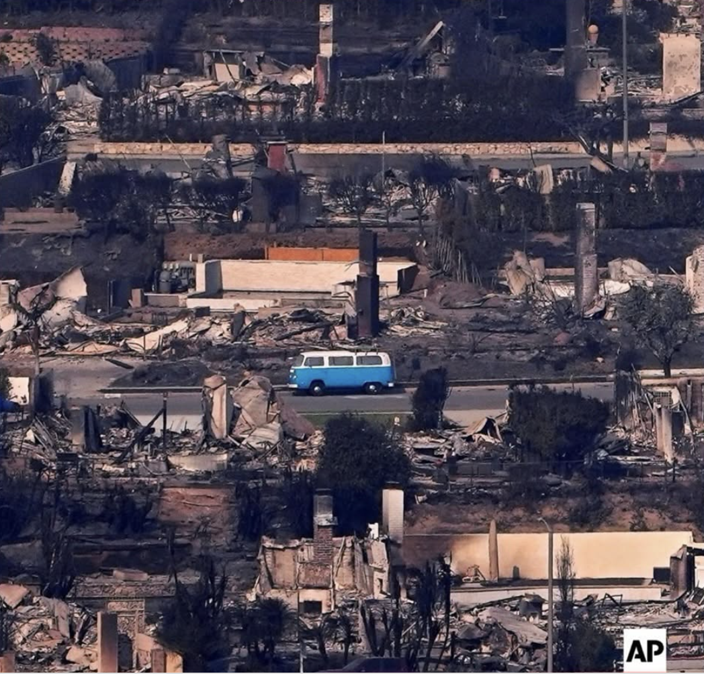

# Visualizing the Aftermath of the Eaton and Palisades Fires



## About

This repository contains a Jupyter notebook that demonstrates how to use false color imagery to visualize the aftermath of the Eaton and Palisades fires that occurred in LA County. Using Landsat 8 surface reflectance data and fire perimeter bands, the analysis highlights the severity and vegetation impacts of the fires.

## Key Outputs:

- True color composite of the fire areas
- False color composite including SWIR, NIR, and Red bands that showcase the aftermath of the fires
- Map overlay of fire perimeters on false color rendered maps

## Repository Structure

```text
C:.
├───data
└───eds220-hw4-task2-false-color-Ferrer-Lozano.ipynb
└───README.md
```

## Data Sources

- Eaton and Palisades Fire Perimeter Data: Dissolved fire perimeter/boundary of the Eaton Fire that took place during January 2025. It was collected by the NIFC FIRIS program and is used to overlay fire boundaries on the Landsat 8 satellite imagery to visualize the fire's impact.


- Landsat 8 Surface Reflectance Data: This dataset contains a collection of bands (red, green, blue, near-infrared and shortwave infrared) from the Landsat Collection 2 Level-2 atmospherically corrected surface reflectance data.

## Data Access

- Eaton and Palisades Fire Perimeter Shapefiles: These files are not included in this repository. To access these files, download them from ArcGIS Hub: [here](https://hub.arcgis.com/maps/ad51845ea5fb4eb483bc2a7c38b2370c). Both files must be downloaded separately.

- Landsat 8 Data: The Landsat 8 data is not included in this repository. Due to the size of this data, it is located on a shared Google Drive folder for the UCSB EDS 220 course. 

## Requirements

This analysis requires the libraries below:

- import os
- import Numpy
- import Rioxarray
- import Matplotlib
- import GeoPandas
- import Xarray 

## References:

Palisades and Eaton Dissolved Fire Perimeters. (2025). Fire perimeter shapefiles [Geospatial dataset]. ArcGIS Hub. https://hub.arcgis.com/maps/ad51845ea5fb4eb483bc2a7c38b2370c  [Accessed Nov. 24, 2025]

U.S. Geological Survey. (2025). Landsat 8 Collection 2 Level-2 surface reflectance data [Satellite imagery dataset]. Microsoft Planetary Computer. https://planetarycomputer.microsoft.com/dataset/landsat-c2-l2  [Accessed Nov. 24, 2025]

Bennett, M. M., Chen, J. K., Alvarez León, L. F., & Gleason, C. J. (2022). The politics of pixels: A review and agenda for critical remote sensing. Progress in Human Geography, 46(3), 729–752. https://doi.org/10.1177/03091325221074691 [Accessed Nov. 24, 2025]

Galaz García, C., Cawse-Nicholson, K., Frew, A., & Fontenot, R. (2024). EDS 220: Working with environmental datasets [Course materials]. Master of Environmental Data Science, Bren School of Environmental Science & Management, University of California, Santa Barbara. https://meds-eds-220.github.io/MEDS-eds-220-course/ [Accessed Nov. 24, 2025]